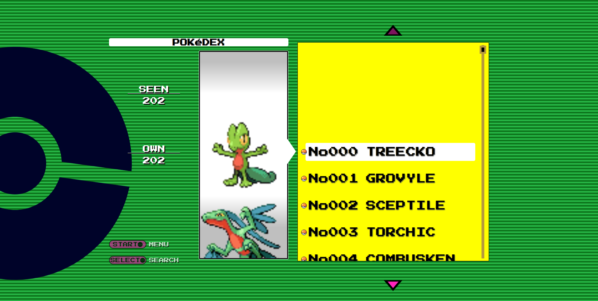
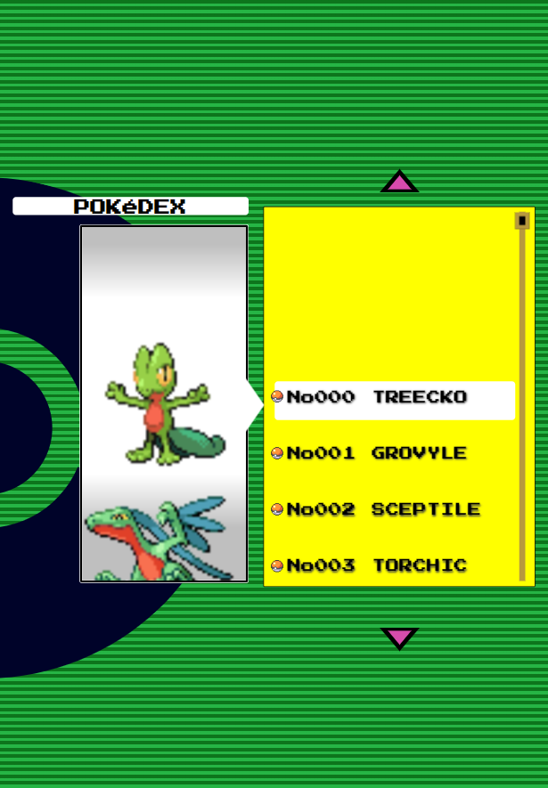
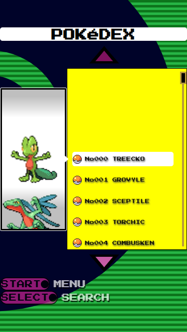

A Pokédex app inspired by Pokemon Emerald (https://youtu.be/VUu3mGuN9S0?t=10). This uses the PokeAPI to retrieve JSON via Fetch and the Document Object Model to render images and names. The custom scrollbar is implemented using the SimpleBar library https://github.com/Grsmto/simplebar

Other features include responsive design, interactive navigation controls and sync scrolling.

